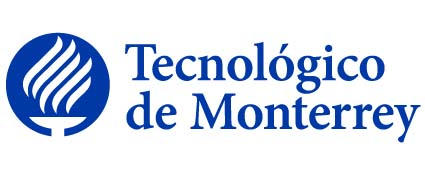
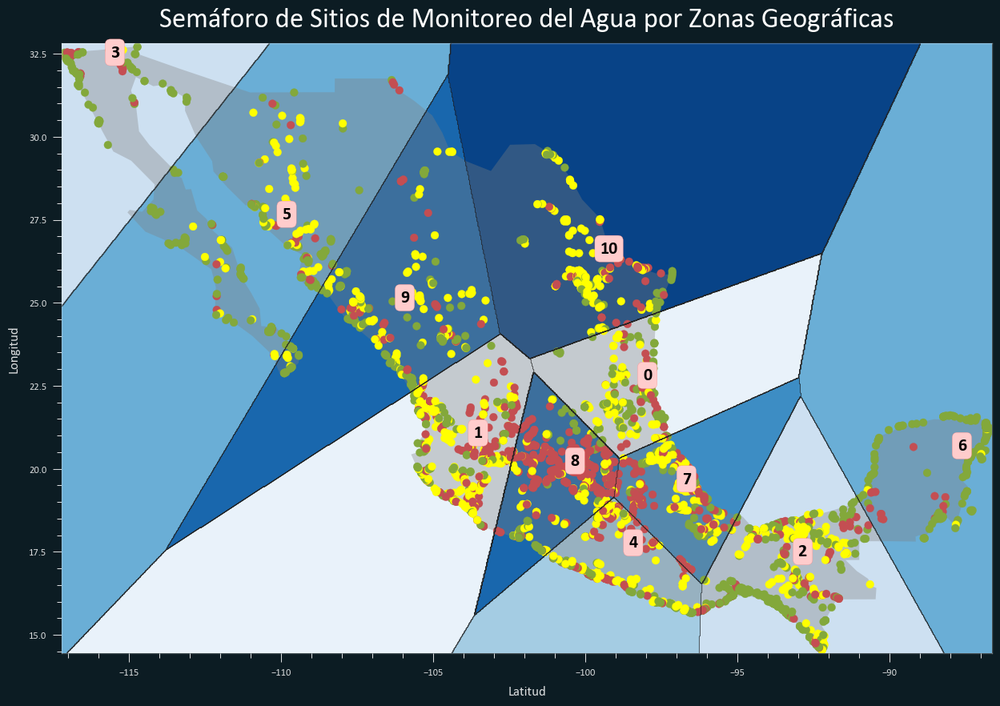

# Proyecto Final -- Base de datos de calidad de agua

* Armando Bringas Corpus (A01200230)
* Walter André Hauri Rosales (A01794237)

> **_NOTA:_**  Recomendamos la visualización en HTML de los notebooks.

## Contenidos

### Reto-> Entrega 1 (16/11) -> Limpieza, análisis, visualización y kmeans

* **Notebook 1 - Regresión**
  * [Jupyter Notebook (.ipnyb)](Proyecto_Final_Parte_I.ipynb)
  * [HTML Notebook](https://htmlpreview.github.io/?https://github.com/PosgradoMNA/actividades-del-projecto-Equipo-100-Oraculos-de-Delfos/blob/main/Proyecto_Final/Proyecto_Final_Parte_I.ipynb)
  * [PDF](Proyecto_Final_Parte_I.pdf)

  

### Reto-> Entrega 2 (18/11) -> Clasificación-ensambles y presentación ejecutiva (10 diapositivas max)

* **Notebook 2 - K-means**
  * [Jupyter Notebook (.ipnyb)](Proyecto_Final_Parte_II.ipynb)
  * [HTML Notebook](https://htmlpreview.github.io/?https://github.com/PosgradoMNA/actividades-del-projecto-Equipo-100-Oraculos-de-Delfos/blob/main/Proyecto_Final/Proyecto_Final_Parte_II.ipynb)
  * [PDF](Proyecto_Final_Parte_II.pdf)
